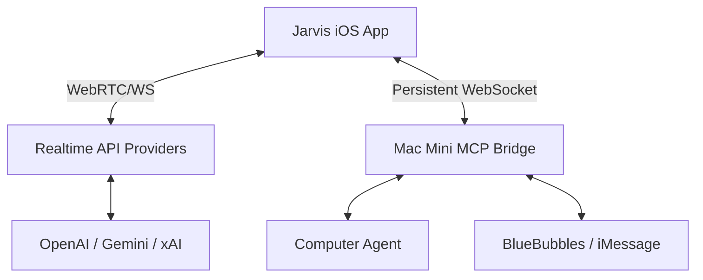

# Jarvis - AI Voice Assistant with Desktop Control

Jarvis is a high-performance, low-latency AI voice assistant for iOS. It features multiple AI provider support (OpenAI, Gemini, xAI), real-time desktop control, and deep iMessage integration via the Model Context Protocol (MCP).

## ✨ Key Features

- **🗣️ Advanced Voice Pro**: Natural conversations using WebRTC and native audio engines (xAI, Gemini, OpenAI).
- **🖥️ Desktop Agent**: Control your Mac via voice. Open apps, take screenshots, run terminal commands, and browse the web.
- **🚀 Background Tasks**: Delegate complex tasks (like "Organize my spreadsheets") and Jarvis will notify you when he's done while you keep talking.
- **💬 iMessage Power-User**: Full BlueBubbles integration. Send messages, fetch history, and even send **Tapbacks** or rename groups via voice.
- **🔍 Vision Support**: Show Jarvis your screen or camera, and he'll help you debug code, find files, or describe what he sees.

## 🏗️ Architecture

## 🛠️ Requirements

- **iOS**: iPhone running iOS 17.0+ (and Xcode 15+ to build).
- **AI Keys**: OpenAI (Realtime API access), xAI (Grok), and/or Google Gemini.
- **Server**: A Mac Mini (or always-on Mac) with [BlueBubbles](https://bluebubbles.app) installed for the iMessage functionality.

## 🚀 Getting Started

### 1. iOS App Setup
1. Clone this repository.
2. Open `Jarvis with MCP.xcodeproj` in Xcode.
3. Build and run on your physical iPhone (WebRTC requires a physical device for microphone reliability).
4. Tap the **Gear Icon** in the app to configure your API keys.

### 2. Mac Mini Bridge Setup
For full functionality, you must set up the MCP bridge on your Mac.
1. Follow the [Step-by-Step Bridge Setup](mac-mini-setup/SETUP_INSTRUCTIONS.md).
2. Ensure `pm2` is running to keep the bridge alive.
3. Note your Cloudflare or Tailscale URL and Bearer Token.

### 3. Connect App to Bridge
1. In the iOS App Settings, under **Custom MCP Server**:
   - **Label**: `bluebubbles`
   - **URL**: `https://your-bridge-url/mcp`
   - **Auth**: Your secure Bearer Token.

## 📁 Project Structure

- `VoiceModeWebRTCSwift/`: Main iOS application source code.
- `mac-mini-setup/`: Server-side bridge and Computer Agent logic.
- `AGENTS.md`: Technical guide for the AI tools and schemas.

## 📜 License

Private repository - all rights reserved.

